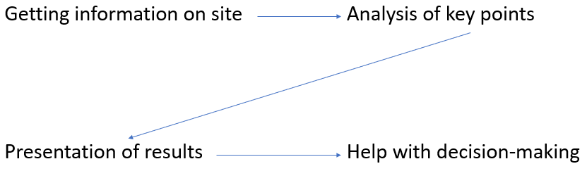
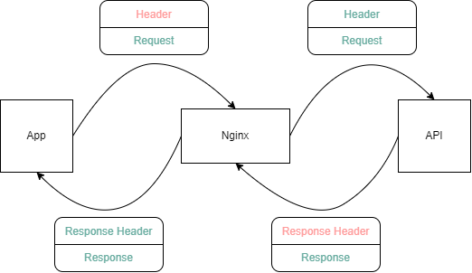
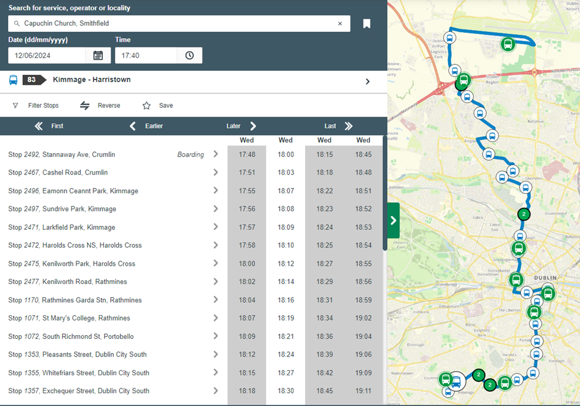

# IrishCitySensors
Internship project in the MISL

The project concerns the repair, configuration, installation of sensors in the city to display information on a map and determine the important points to study.

## The first project : air quality sensors
You can found the report at the root of the project with the name : ***AdamOBrienReport.pdf***.
The website no longer in operation but you can find it here : https://cs1.ucc.ie/~cb-lab/locations.php.
I put the sensors back into working order. The data sending part between the raspberry and the server must be done. (the server part of this first project is lost)

## National API : data of public transport
This part specializes in collecting bus data.
You can find official documentation about the API here : https://www.transportforireland.ie/transitData/PT_Data.html ; https://developer.nationaltransport.ie/api-details#api=gtfsr&operation=vehicles and https://gtfs.org/realtime/reference/.

## Telraam S2 : traffic sensors
Official documentation : https://documenter.getpostman.com/view/8210376/TWDRqyaV#intro.
If you need more information about these sensors or access to the account, ask to a supervisor and go to this website : https://telraam.net/en/login.

## React project
I use *React Leaflet* to display the map (https://react-leaflet.js.org / https://leafletjs.com).
For graphics I use *canvasjs/react-charts* (https://www.npmjs.com/package/@canvasjs/react-charts).

The nginx server is necessary to modify the headers and access information from the different APIs.

It also be usefull to hide API keys (remove them from the react code and add them in header) if you want to deploy the project.

I will put my report here as soon as I finish it.

## For the futur
If the project is recovered, here are some avenues to explore :

- Add public vehicles like bikes (https://data.gov.ie/dataset/coca-cola-zero-bikes or https://data.corkcity.ie/dataset/coca-cola-zero-bikes).
- Analysis of bus delays on their journey and display of the path and stops visited (https://www.transportforireland.ie/plan-a-journey/timetables/#maincontent and https://developers.google.com/transit/gtfs-realtime?hl=en).

- Add important points like monuments to explain traffic (https://overpass-turbo.eu/index.html).
- Expand horizons with more cities.